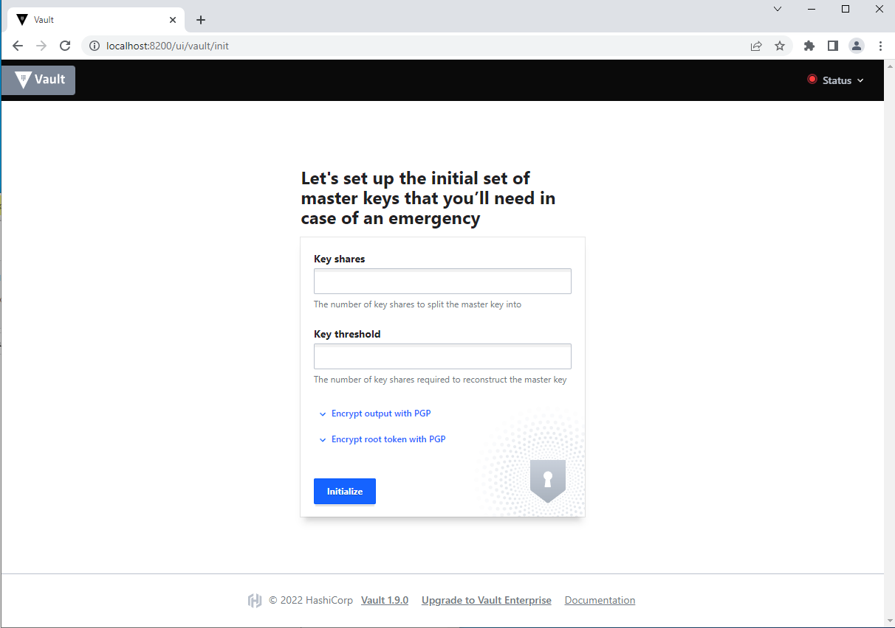
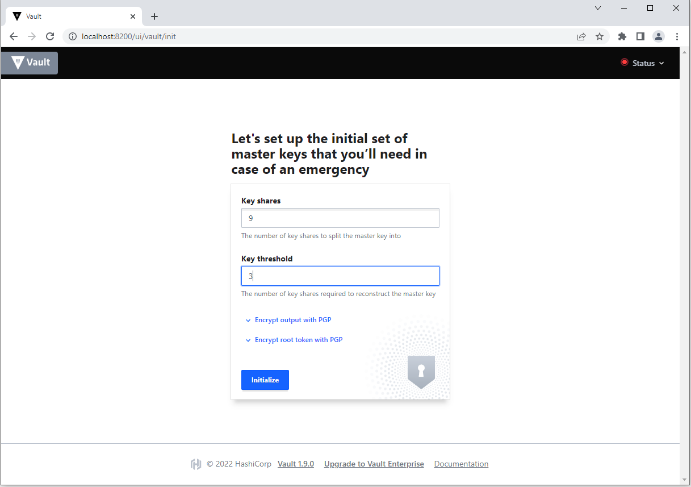
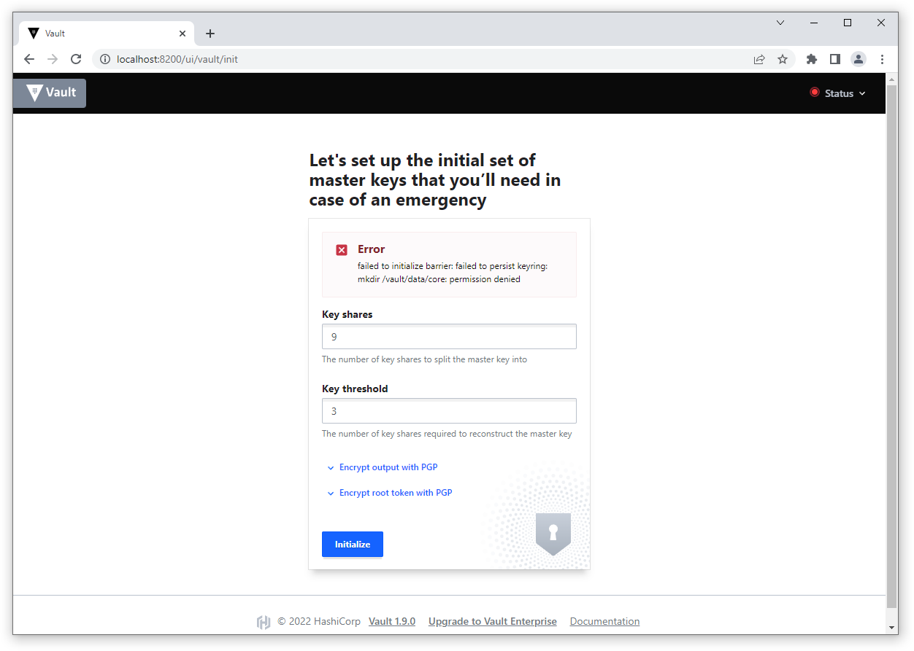
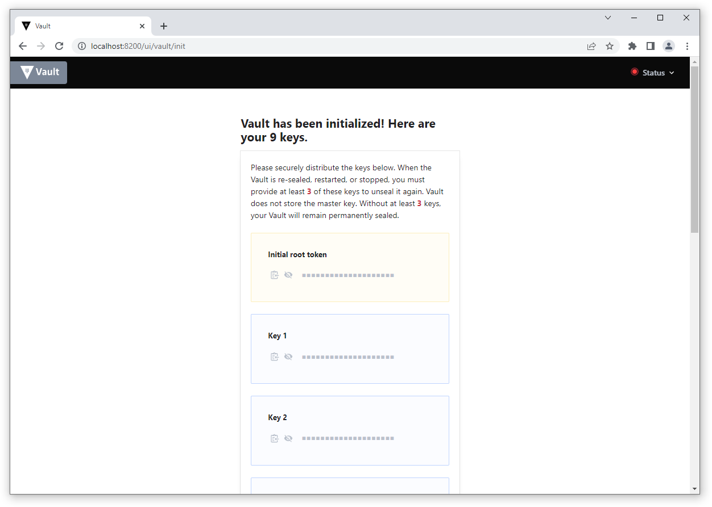
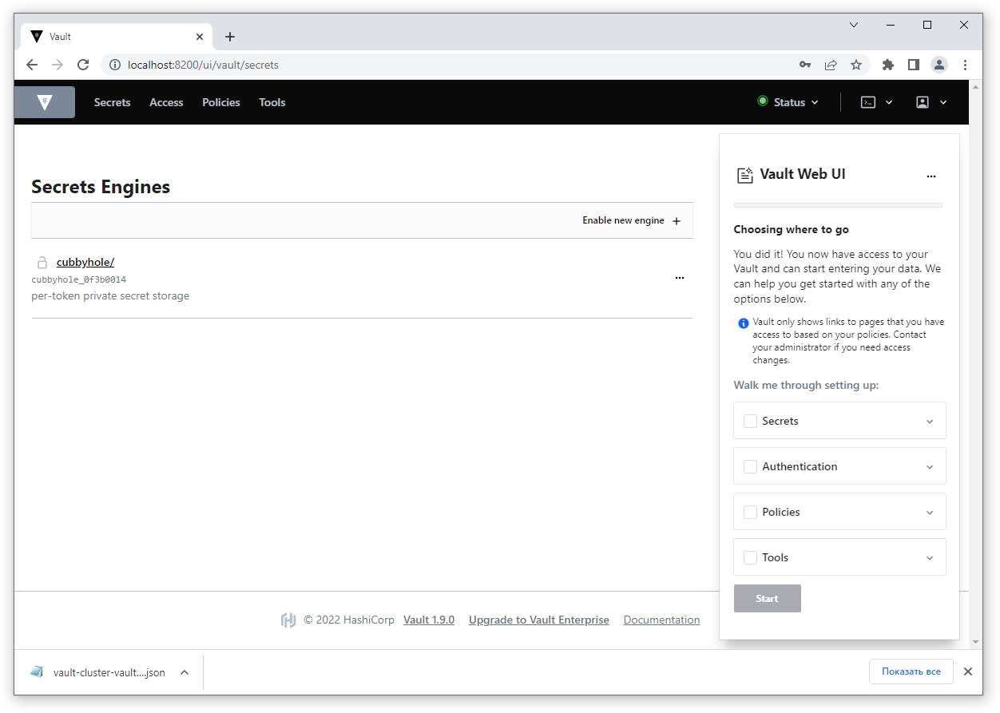
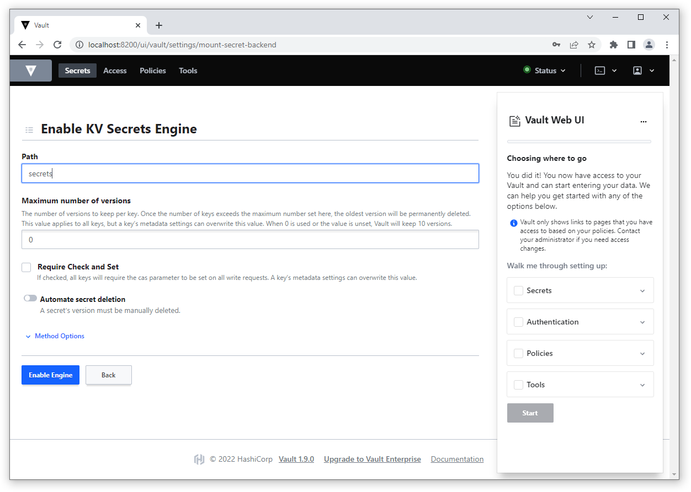
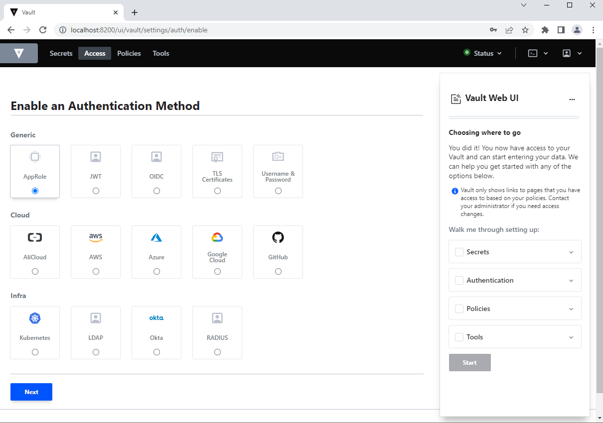

# Домашнее задание к занятию "14.2 Синхронизация секретов с внешними сервисами. Vault"

## Задача 1: Работа с модулем Vault

Запустить модуль Vault конфигураций через утилиту kubectl в установленном minikube

```
kubectl apply -f 14.2/vault-pod.yml
```

```
> kubectl create ns netology
namespace/netology created
devuser@devuser-virtual-machine:~/clokub-homeworks/14.2/manifests$
> kubens netology 
Context "netology3" modified.
Active namespace is "netology".
devuser@devuser-virtual-machine:~/clokub-homeworks/14.2/manifests$
> ls
vault-pod.yml
devuser@devuser-virtual-machine:~/clokub-homeworks/14.2/manifests$
> kubectl apply -f vault-pod.yml 
pod/14.2-netology-vault created
devuser@devuser-virtual-machine:~/clokub-homeworks/14.2/manifests$
> kubectl get po
NAME                  READY   STATUS              RESTARTS   AGE
14.2-netology-vault   0/1     ContainerCreating   0          7s
devuser@devuser-virtual-machine:~/clokub-homeworks/14.2/manifests$
> watch kubectl get po
devuser@devuser-virtual-machine:~/clokub-homeworks/14.2/manifests$
>  kubectl get po
NAME                  READY   STATUS    RESTARTS   AGE
14.2-netology-vault   1/1     Running   0          90s

```


Получить значение внутреннего IP пода

```
kubectl get pod 14.2-netology-vault -o json | jq -c '.status.podIPs'
```

```
> kubectl get pod 14.2-netology-vault -o json | jq -c '.status.podIPs'
[{"ip":"10.233.90.132"}]
d
```

Примечание: jq - утилита для работы с JSON в командной строке

Запустить второй модуль для использования в качестве клиента

```
kubectl run -i --tty fedora --image=fedora --restart=Never -- sh
```

Установить дополнительные пакеты

```
dnf -y install pip
pip install hvac
```

```
> kubectl run -i --tty fedora --image=fedora --restart=Never -- sh
If you don't see a command prompt, try pressing enter.
sh-5.1# dnf -y install pip
Fedora 36 - x86_64                                                                                                               3.8 MB/s |  81 MB     00:21    
Fedora 36 openh264 (From Cisco) - x86_64                                                                        432  B/s | 2.5 kB     00:05    
Fedora Modular 36 - x86_64                                                                                      985 kB/s | 2.4 MB     00:02    
Fedora 36 - x86_64 - Updates                                                                                    3.1 MB/s |  25 MB     00:08    
Fedora Modular 36 - x86_64 - Updates                                                                            604 kB/s | 2.5 MB     00:04    
Last metadata expiration check: 0:00:01 ago on Tue Aug  9 10:35:31 2022.
Dependencies resolved.
================================================================================================================================================
 Package                                  Architecture                 Version                               Repository                    Size
================================================================================================================================================
Installing:
 python3-pip                              noarch                       21.3.1-2.fc36                         fedora                       1.8 M
Installing weak dependencies:
 libxcrypt-compat                         x86_64                       4.4.28-1.fc36                         fedora                        90 k
 python3-setuptools                       noarch                       59.6.0-2.fc36                         fedora                       936 k

Transaction Summary
================================================================================================================================================
Install  3 Packages

Total download size: 2.8 M
Installed size: 14 M
Downloading Packages:
(1/3): libxcrypt-compat-4.4.28-1.fc36.x86_64.rpm                                                                106 kB/s |  90 kB     00:00    
(2/3): python3-pip-21.3.1-2.fc36.noarch.rpm                                                                     1.3 MB/s | 1.8 MB     00:01    
(3/3): python3-setuptools-59.6.0-2.fc36.noarch.rpm                                                              608 kB/s | 936 kB     00:01    
------------------------------------------------------------------------------------------------------------------------------------------------
Total                                                                                                           674 kB/s | 2.8 MB     00:04     
Running transaction check
Transaction check succeeded.
Running transaction test
Transaction test succeeded.
Running transaction
  Preparing        :                                                                                                                        1/1 
  Installing       : python3-setuptools-59.6.0-2.fc36.noarch                                                                                1/3 
  Installing       : libxcrypt-compat-4.4.28-1.fc36.x86_64                                                                                  2/3 
  Installing       : python3-pip-21.3.1-2.fc36.noarch                                                                                       3/3 
  Running scriptlet: python3-pip-21.3.1-2.fc36.noarch                                                                                       3/3 
  Verifying        : libxcrypt-compat-4.4.28-1.fc36.x86_64                                                                                  1/3 
  Verifying        : python3-pip-21.3.1-2.fc36.noarch                                                                                       2/3 
  Verifying        : python3-setuptools-59.6.0-2.fc36.noarch                                                                                3/3 

Installed:
  libxcrypt-compat-4.4.28-1.fc36.x86_64           python3-pip-21.3.1-2.fc36.noarch           python3-setuptools-59.6.0-2.fc36.noarch          

Complete!
sh-5.1# 
```

```
sh-5.1# pip install hvac
Collecting hvac
  Downloading hvac-0.11.2-py2.py3-none-any.whl (148 kB)
     |████████████████████████████████| 148 kB 540 kB/s            
Collecting six>=1.5.0
  Downloading six-1.16.0-py2.py3-none-any.whl (11 kB)
Collecting requests>=2.21.0
  Downloading requests-2.28.1-py3-none-any.whl (62 kB)
     |████████████████████████████████| 62 kB 449 kB/s            
Collecting certifi>=2017.4.17
  Downloading certifi-2022.6.15-py3-none-any.whl (160 kB)
     |████████████████████████████████| 160 kB 3.9 MB/s            
Collecting charset-normalizer<3,>=2
  Downloading charset_normalizer-2.1.0-py3-none-any.whl (39 kB)
Collecting idna<4,>=2.5
  Downloading idna-3.3-py3-none-any.whl (61 kB)
     |████████████████████████████████| 61 kB 2.8 MB/s            
Collecting urllib3<1.27,>=1.21.1
  Downloading urllib3-1.26.11-py2.py3-none-any.whl (139 kB)
     |████████████████████████████████| 139 kB 4.0 MB/s            
Installing collected packages: urllib3, idna, charset-normalizer, certifi, six, requests, hvac
Successfully installed certifi-2022.6.15 charset-normalizer-2.1.0 hvac-0.11.2 idna-3.3 requests-2.28.1 six-1.16.0 urllib3-1.26.11
WARNING: Running pip as the 'root' user can result in broken permissions and conflicting behaviour with the system package manager. It is recommended to use a virtual environment instead: https://pip.pypa.io/warnings/venv
sh-5.1# 
```
Запустить интепретатор Python и выполнить следующий код, предварительно
поменяв IP и токен

```
import hvac
client = hvac.Client(
    url='http://10.10.133.71:8200',
    token='aiphohTaa0eeHei'
)
client.is_authenticated()

# Пишем секрет
client.secrets.kv.v2.create_or_update_secret(
    path='hvac',
    secret=dict(netology='Big secret!!!'),
)

# Читаем секрет
client.secrets.kv.v2.read_secret_version(
    path='hvac',
)
```

```
sh-5.1# python3
Python 3.10.4 (main, Mar 25 2022, 00:00:00) [GCC 12.0.1 20220308 (Red Hat 12.0.1-0)] on linux
Type "help", "copyright", "credits" or "license" for more information.
>>> import hvac
10.233.90.132:8200',
    token='aiphohTaa0eeHei'
)
client.is_authenticated()

#write secret
client.secrets.kv.v2.create_or_update_secret(
    path='hvac',
    secret=dict(netology='Big secret!!!'),
)

#Read secret
client.secrets.kv.v2.read_secret_version(
    path='hvac',
)
>>> client = hvac.Client(
...     url='http://10.233.90.132:8200',
...     token='aiphohTaa0eeHei'
... )
>>> client.is_authenticated()
True
>>> 
>>> #write secret
>>> client.secrets.kv.v2.create_or_update_secret(
...     path='hvac',
...     secret=dict(netology='Big secret!!!'),
... )
{'request_id': '6eb74e05-cda9-2214-3678-61479be5be46', 'lease_id': '', 'renewable': False, 'lease_duration': 0, 'data': {'created_time': '2022-08-09T10:53:20.102832893Z', 'custom_metadata': None, 'deletion_time': '', 'destroyed': False, 'version': 3}, 'wrap_info': None, 'warnings': None, 'auth': None}
>>> 
>>> #Read secret
>>> client.secrets.kv.v2.read_secret_version(
...     path='hvac',
... )
{'request_id': 'f1ab1906-7c3e-318b-3eb4-3e7088c6fe4b', 'lease_id': '', 'renewable': False, 'lease_duration': 0, 'data': {'data': {'netology': 'Big secret!!!'}, 'metadata': {'created_time': '2022-08-09T10:53:20.102832893Z', 'custom_metadata': None, 'deletion_time': '', 'destroyed': False, 'version': 3}}, 'wrap_info': None, 'warnings': None, 'auth': None}
```

## Задача 2 (*): Работа с секретами внутри модуля

* На основе образа fedora создать модуль;
* Создать секрет, в котором будет указан токен;
* Подключить секрет к модулю;
* Запустить модуль и проверить доступность сервиса Vault.

---

Создадим namespace
```
> kubectl create ns netology-test
namespace/netology-test created
opsuser@opsserver:~$ 
> kubens netology-test 
Context "kubernetes-admin@cluster.local" modified.
Active namespace is "netology-test".
```

Развернем Vault

Выделим том:
```
#pv.yaml

apiVersion: v1
kind: PersistentVolume
metadata:
  name: pv3
spec:
  storageClassName: "nfs-client"
  accessModes:
    - ReadWriteOnce
  capacity:
    storage: 1Gi
  hostPath:
    path: /data/pv3
```

Затем поднимем сам Vault

Применим манифесты:
00-cm.yaml
01-ss.yaml
02-svc.yaml

Проверяем:

```
Every 2.0s: kubectl get po,svc                                                        opsserver: Fri Aug 19 16:20:42 2022

NAME          READY   STATUS    RESTARTS   AGE
pod/vault-0   1/1     Running   0          11m

NAME            TYPE        CLUSTER-IP   EXTERNAL-IP   PORT(S)    AGE
service/vault   ClusterIP   None         <none>        8200/TCP   11m
```

Пробросим порт 8200

```
opsuser@opsserver:~/home_works/clokub-homeworks/14.2/demoapps/vault$ 
> kubectl port-forward vault-0 8200:8200
Forwarding from 127.0.0.1:8200 -> 8200
Handling connection for 8200
```

Проверяем в браузере






Выдадим права на запись в папке (где появился pv) на той ноде где развернулся statefulset для vault
```
sudo chmod -R 777 /data

```



Скачиваем ключи и распечатываем хранилище. Ввыодим любые 3 ключа и рут токен



Хранилище Vault готово к использованию:

Развернем контейнер c nginx c конфигом, где прописано что при запросе по пути / будет происходить коннект к Vault и чтение секрета из папки secrets  движка kv

Перед тем как применять манифесты, нужно включить движок kv указав папку secrets




Чтобы иметь возможность работать с Vault через cli установим его

```
sudo snap install vault
```

Настроим переменыне окружения для подключения к vault и поместим секретные  данные

```
opsuser@opsserver:~$ 
> export VAULT_ADDR=http://127.0.0.1:8200
opsuser@opsserver:~$ 
> export VAULT_TOKEN=token
opsuser@opsserver:~$ 
> vault kv put secrets/k11s/demo/app/nginx responseText="Hello from Vault"
Key                Value
---                -----
created_time       2022-08-19T12:23:08.912556421Z
custom_metadata    <nil>
deletion_time      n/a
destroyed          false
version            1

```
Создадим политику для роли:

```
> vault policy write -tls-skip-verify nginx_conf_demo -<<EOF
> # Read-only permission on secrets stored at 'secrets/k11s/demo/app/nginx'
> path "secrets/data/k11s/demo/app/nginx" {
>   capabilities = [ "read" ]
> }
> EOF
Success! Uploaded policy: nginx_conf_demo

```

Для аутентификации через роль нужно включить соответствующий метод



Создадим роль
```
> vault write -tls-skip-verify auth/approle/role/nginx-demo \
>   token_policies="nginx_conf_demo" \
>   token_ttl=1h \
>   token_max_ttl=4h \
>   secret_id_bound_cidrs="0.0.0.0/0","127.0.0.1/32" \
>   token_bound_cidrs="0.0.0.0/0","127.0.0.1/32" \
>   secret_id_ttl=60m policies="nginx_conf_demo" \
>   bind_secret_id=false
Success! Data written to: auth/approle/role/nginx-demo
```

Проверяем наличие роли:

```
>  vault read -tls-skip-verify auth/approle/role/nginx-demo
Key                        Value
---                        -----
bind_secret_id             false
local_secret_ids           false
policies                   [nginx_conf_demo]
secret_id_bound_cidrs      [0.0.0.0/0 127.0.0.1/32]
secret_id_num_uses         0
secret_id_ttl              1h
token_bound_cidrs          [0.0.0.0/0 127.0.0.1]
token_explicit_max_ttl     0s
token_max_ttl              4h
token_no_default_policy    false
token_num_uses             0
token_period               0s
token_policies             [nginx_conf_demo]
token_ttl                  1h
token_type                 default

```

Получаем roleid, который нужно прописать в манифесте для nginx

```
> vault read -tls-skip-verify auth/approle/role/nginx-demo/role-id
Key        Value
---        -----
role_id    c7b3c0a7-e880-46ef-9110-d9e17565043d
```

Прописываем roleid в файле 00-cm.yaml

и применяем манифесты:

```
opsuser@opsserver:~/home_works/clokub-homeworks/14.2/demoapps/nginx$ 
> kubectl apply -f 00-cm.yaml 
configmap/vault-nginx-template created
configmap/vault-agent-configs created
opsuser@opsserver:~/home_works/clokub-homeworks/14.2/demoapps/nginx$ 
> kubectl apply -f 01-dp.yaml
deployment.apps/nginx-autoreload created
opsuser@opsserver:~/home_works/clokub-homeworks/14.2/demoapps/nginx$ 

```
Смотрим поды
```
Every 2.0s: kubectl get po,svc -o wide                                                                opsserver: Fri Aug 19 17:44:50 2022

NAME                                    READY   STATUS    RESTARTS   AGE     IP              NODE    NOMINATED NODE   READINESS GATES
pod/nginx-autoreload-7fc59bc88f-wj9r9   2/2     Running   0          5m58s   10.233.96.210   node2   <none>           <none>
pod/vault-0                             1/1     Running   0          95m     10.233.90.162   node1   <none>           <none>

NAME            TYPE        CLUSTER-IP   EXTERNAL-IP   PORT(S)    AGE   SELECTOR
service/vault   ClusterIP   None         <none>        8200/TCP   95m   app=vault

```

Пробрасываем порт 8080


```
> kubectl port-forward nginx-autoreload-7fc59bc88f-wj9r9 8080:8080
Forwarding from 127.0.0.1:8080 -> 8080
Handling connection for 8080
```

Смотрим в браузере


Если изменить значение секрета, то данные обновятся через минуту

---
Разворот Go приложения 

Добавляем секретные данные в vault

```
> vault kv put secrets/k11s/demo/app/service db_name="users" username="admin" password="passw0rd"
Key                Value
---                -----
created_time       2022-08-20T18:34:51.652427797Z
custom_metadata    <nil>
deletion_time      n/a
destroyed          false
version            1
```

Создадим политику для роли

```
> vault policy write -tls-skip-verify app_policy_name -<<EOF
> # Read-only permission on secrets stored at 'secrets/k11s/demo/app/service'
> path "secrets/data/k11s/demo/app/service" {
>   capabilities = [ "read" ]
> }
> EOF
Success! Uploaded policy: app_policy_name
```

Создаем роль
```
> vault write -tls-skip-verify auth/approle/role/my-app-role \
>   token_policies="app_policy_name" \
>   token_ttl=1h \
>   token_max_ttl=4h \
>   secret_id_bound_cidrs="0.0.0.0/0","127.0.0.1/32" \
>   token_bound_cidrs="0.0.0.0/0","127.0.0.1/32" \
>   secret_id_ttl=60m policies="app_policy_name" \
>   bind_secret_id=false
Success! Data written to: auth/approle/role/my-app-role
```

Проверяем роль

```
> vault read -tls-skip-verify auth/approle/role/my-app-role
Key                        Value
---                        -----
bind_secret_id             false
local_secret_ids           false
policies                   [app_policy_name]
secret_id_bound_cidrs      [0.0.0.0/0 127.0.0.1/32]
secret_id_num_uses         0
secret_id_ttl              1h
token_bound_cidrs          [0.0.0.0/0 127.0.0.1]
token_explicit_max_ttl     0s
token_max_ttl              4h
token_no_default_policy    false
token_num_uses             0
token_period               0s
token_policies             [app_policy_name]
token_ttl                  1h
token_type                 default
```

Получаем Role id

```
> vault read -tls-skip-verify auth/approle/role/my-app-role/role-id
Key        Value
---        -----
role_id    541de81c-6583-b550-b482-183d497b9254
```

Прописываем это значение в 00-cm.yaml

Применяем манифесты.


Смотрим поды

```
Every 2.0s: kubectl get po,svc -o wide                                                                     opsserver: Sat Aug 20 23:44:44 2022

NAME                                     READY   STATUS             RESTARTS       AGE    IP              NODE    NOMINATED NODE   READINESS G
ATES
pod/netology-14.3                        1/1     Running            1 (20m ago)    81m    10.233.96.249   node2   <none>           <none>
pod/nginx-autoreload-7fc59bc88f-mj9k2    2/2     Running            0              14m    10.233.90.174   node1   <none>           <none>
pod/vault-0                              1/1     Running            0              79m    10.233.96.250   node2   <none>           <none>
pod/vault-approle-demo-fcf5cc6cc-zb7cb   1/2     CrashLoopBackOff   5 (107s ago)   5m1s   10.233.90.175   node1   <none>           <none>

NAME            TYPE        CLUSTER-IP   EXTERNAL-IP   PORT(S)    AGE   SELECTOR
service/vault   ClusterIP   None         <none>        8200/TCP   79m   app=vault
```


В результате go приложение должно аторизоваться в vault и забрать секрет и показать в логах

```
Every 2.0s: kubectl logs pod/vault-approle-demo-fcf5cc6cc-zb7cb --all-containers                           opsserver: Sat Aug 20 23:42:15 2022

2022-08-20T18:39:44.681Z [INFO]  sink.file: creating file sink
2022-08-20T18:39:44.681Z [INFO]  sink.file: file sink configured: path=/etc/vault/config/approle/wrapped_token mode=-rwxrwxrwx
2022-08-20T18:39:44.681Z [INFO]  sink.file: creating file sink
2022-08-20T18:39:44.681Z [INFO]  sink.file: file sink configured: path=/etc/vault/config/approle/unwrapped_token mode=-rwxrwxrwx
==> Vault agent started! Log data will stream in below:

==> Vault agent configuration:

                     Cgo: disabled
               Log Level: info
                 Version: Vault v1.9.0

2022-08-20T18:39:44.682Z [INFO]  template.server: starting template server
2022-08-20T18:39:44.682Z [INFO]  template.server: no templates found
2022-08-20T18:39:44.682Z [INFO]  auth.handler: starting auth handler
2022-08-20T18:39:44.682Z [INFO]  auth.handler: authenticating
2022-08-20T18:39:44.682Z [INFO]  sink.server: starting sink server
2022-08-20T18:39:44.686Z [INFO]  auth.handler: authentication successful, sending token to sinks
2022-08-20T18:39:44.686Z [INFO]  auth.handler: starting renewal process
2022-08-20T18:39:44.688Z [INFO]  sink.file: token written: path=/etc/vault/config/approle/wrapped_token
2022-08-20T18:39:44.689Z [INFO]  sink.file: token written: path=/etc/vault/config/approle/unwrapped_token
2022-08-20T18:39:44.689Z [INFO]  sink.server: sink server stopped
2022-08-20T18:39:44.689Z [INFO]  sinks finished, exiting
2022-08-20T18:39:44.689Z [INFO]  auth.handler: shutdown triggered, stopping lifetime watcher
2022-08-20T18:39:44.689Z [INFO]  auth.handler: auth handler stopped
2022-08-20T18:39:44.689Z [INFO]  template.server: template server stopped
passw0rd admin


```

как видим, секрет passw0rd admin получен.


---
